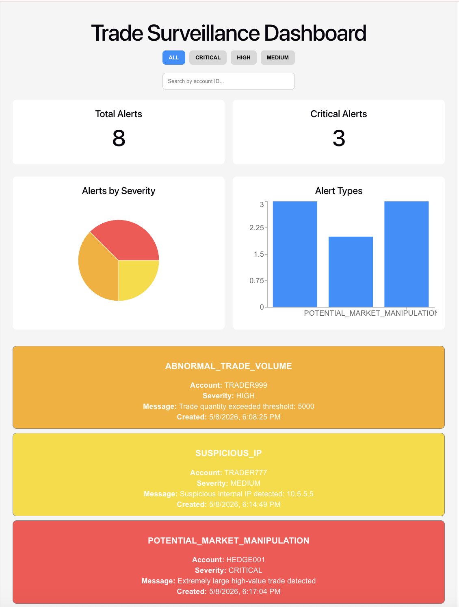

# Trade Surveillance Dashboard

A full-stack financial trade monitoring platform that simulates real-time surveillance workflows used in professional trading and fintech environments. The system ingests live trade data, applies a rules-based anomaly detection engine, and surfaces alerts through an interactive analytics dashboard — mirroring the kind of tooling used by compliance and risk teams at trading firms. Built with React, Spring Boot, and PostgreSQL.

---

## Dashboard 



## Features

- **Real-time trade monitoring** — live feed of incoming trades with instant visibility
- **Automated anomaly detection** — rules-based engine flags suspicious activity as it happens
- **Suspicious IP detection** — identifies and surfaces trades originating from flagged addresses
- **High-volume trade alerts** — automatic alerts for trades exceeding defined volume thresholds
- **Market manipulation detection** — pattern-based detection of potential manipulative behavior
- **Interactive charts & analytics** — visual dashboards powered by Recharts
- **REST API integration** — clean API layer connecting frontend and backend
- **PostgreSQL persistence** — durable storage for trades, alerts, and audit history
- **Filtering & search** — quickly locate trades or alerts by symbol, status, IP, or time range

---

## Tech Stack

| Layer | Technology |
|---|---|
| **Frontend** | React, Vite, Recharts, CSS |
| **Backend** | Java, Spring Boot, Spring Data JPA |
| **Database** | PostgreSQL |

---

## Alert Detection Logic

The surveillance engine automatically generates alerts for the following conditions:

| Alert Type | Trigger |
|---|---|
| Abnormal Trade Volume | Trade quantity is greater than or equal to 1000 |
| Suspicious IP Address | Source IP matches flagged address list |
| High-Value Trade | Trade value surpasses monetary limit |
| Market Manipulation | Patterns indicative of layering or spoofing detected |

---

## API Endpoints

### Trades

| Method | Endpoint | Description |
|---|---|---|
| `GET` | `/api/trades` | Retrieve all trades |
| `POST` | `/api/trades` | Submit a new trade |

### Alerts

| Method | Endpoint | Description |
|---|---|---|
| `GET` | `/api/alerts` | Retrieve all generated alerts |

---

## Getting Started
Start the backend first, then the frontend. The frontend expects the API to be running at http://localhost:8080 before connecting.

### Prerequisites

Make sure you have the following installed before running the project:

- Java 17+
- Node.js 18+
- PostgreSQL 14+
- Maven (or use the included `./mvnw` wrapper)

### Database Setup

1. Create a PostgreSQL database:

```sql
CREATE DATABASE trade_surveillance;
```

2. Update your database credentials in `backend/src/main/resources/application.properties`:

```properties
spring.datasource.url=jdbc:postgresql://localhost:5432/trade_surveillance
spring.datasource.username=your_username
spring.datasource.password=your_password
```

### Running the Backend

```bash
cd backend
./mvnw spring-boot:run
```

The API will be available at `http://localhost:8080`.

### Running the Frontend

```bash
cd frontend
npm install
npm run dev
```

The dashboard will be available at `http://localhost:5173`.

---

## Project Structure

```
trade-surveillance-system-java/
├── backend/
│   ├── src/main/java/com/elina/tradesurveillance/
│   │   ├── controller/        # REST controllers
│   │   ├── model/             # Trade & Alert entities
│   │   ├── repository/        # JPA repositories
│   │   ├── service/           # Surveillance logic
│   │   └── TradesurveillanceApplication.java
│   ├── resources/application.properties
│   └── pom.xml
├── frontend/
│   ├── src/
│   │   ├── App.jsx
│   │   └── main.jsx
│   └── package.json
├── postman/                   # API collections & environments
├── images/                    # Dashboard screenshots
└── README.md
```

---

## License

This project is licensed under the MIT License. See `LICENSE` for details.
